# FlashFuzzy

<p align="center">
  <strong>High-performance fuzzy search engine powered by Rust and WebAssembly</strong><br>
  <em>One Rust core, native bindings for every platform</em>
</p>

<p align="center">
  <a href="https://www.npmjs.com/package/flashfuzzy"></a>
  <a href="https://github.com/RafaCalRob/FlashFuzzy/blob/main/LICENSE"></a>
  
</p>

<p align="center">
  <a href="https://bdovenbird.com/flash-fuzzy/">📖 Documentation</a> •
  <a href="https://bdovenbird.com/flash-fuzzy/playground">🎮 Live Demo</a> •
  <a href="#platform-support">🌐 Platform Support</a>
</p>

---

## What is FlashFuzzy?

FlashFuzzy is a **high-performance fuzzy search library** built in Rust. This repository serves as the **central hub** that generates native bindings for multiple platforms via FFI (Foreign Function Interface).

### Key Features

- ⚡ **Sub-millisecond search** on 100K+ records
- 🎯 **Typo-tolerant** matching with configurable error distance
- 🪶 **Tiny bundle** - ~3KB WASM binary (1.5KB gzipped)
- 🚀 **Zero dependencies** - Pure Rust core (~450 lines)
- 🌐 **Multi-platform** - JavaScript, Python, Go, Java, Kotlin, Android, Rust
- 💪 **Production ready** - Battle-tested algorithms (Bitap + Bloom Filter)

### How It Works

FlashFuzzy combines two powerful algorithms for maximum performance:

1. **Bloom Filter Pre-filtering** - Rejects 80-95% of non-matching records in O(1)
2. **Bitap Algorithm** - Fast bit-parallel fuzzy matching

**Result:** 10-100x faster than traditional fuzzy search libraries.

---

## Platform Support

This repository contains the Rust core implementation and bindings for multiple platforms:

| Platform | Package | Installation | Status |
|----------|---------|--------------|--------|
| **JavaScript/TypeScript** | `flashfuzzy` | `npm install flashfuzzy` | ✅ Ready |
| **Python** | `flashfuzzy` | `pip install flashfuzzy` | 🚧 Coming soon |
| **Go** | `flashfuzzy-go` | `go get github.com/RafaCalRob/flashfuzzy-go` | 🚧 Coming soon |
| **Java/Kotlin** | `flashfuzzy` | Maven Central | 🚧 Coming soon |
| **Android** | `flashfuzzy-android` | Maven Central | 🚧 Coming soon |
| **Rust** | `flashfuzzy-core` | `cargo add flashfuzzy-core` | ✅ Ready |

All bindings are built from the same Rust core, ensuring consistency across platforms.

---

## Quick Start

### JavaScript/TypeScript

```bash
npm install flashfuzzy
```

```javascript
import { FlashFuzzy } from 'flashfuzzy';

const ff = await FlashFuzzy.init({ threshold: 0.25 });
ff.add([
  { id: 1, name: "Wireless Headphones" },
  { id: 2, name: "Mechanical Keyboard" }
]);

const results = ff.search("keyboard");
```

**Full documentation:** [JavaScript Docs](https://bdovenbird.com/flash-fuzzy/)

### Python (Coming Soon)

```bash
pip install flashfuzzy
```

```python
from flashfuzzy import FlashFuzzy

ff = FlashFuzzy(threshold=0.25)
ff.add([{"id": 1, "name": "Product A"}])
results = ff.search("product")
```

### Go (Coming Soon)

```bash
go get github.com/RafaCalRob/flashfuzzy-go
```

```go
import "github.com/RafaCalRob/flashfuzzy-go"

ff := flashfuzzy.New(0.25, 50)
ff.Add(1, "Product A")
results := ff.Search("product")
```

### Java/Kotlin (Coming Soon)

```xml
<dependency>
  <groupId>com.flashfuzzy</groupId>
  <artifactId>flashfuzzy</artifactId>
  <version>0.1.0</version>
</dependency>
```

```java
FlashFuzzy ff = new FlashFuzzy(0.25, 50);
ff.addRecord(1, "Product A");
List<SearchResult> results = ff.search("product");
```

---

## Repository Structure

```
FlashFuzzy/
├── rust/                      # Core Rust implementation
│   ├── core/                 # Bitap + Bloom + Memory Pool (~450 lines)
│   ├── wasm/                 # WebAssembly binding → npm
│   └── ffi/                  # C FFI layer for other languages
│
├── js/                        # TypeScript wrapper for WASM
│   └── src/index.ts          # JavaScript/TypeScript API
│
├── bindings/                  # Platform-specific bindings
│   ├── python/               # PyO3 → PyPI
│   ├── go/                   # CGO → Go modules
│   ├── java/                 # JNI → Maven
│   └── android/              # JNI + NDK → Android
│
├── tests/                     # Cross-platform test suite
└── dist/                      # Built artifacts (WASM, JS)
```

---

## Architecture

FlashFuzzy uses a layered architecture to support multiple platforms from a single Rust core:

```mermaid
flowchart TB
    subgraph CORE["Rust Core (no_std)"]
        BITAP[Bitap Algorithm]
        BLOOM[Bloom Filter]
        MEMORY[Memory Pool]
    end

    subgraph FFI["FFI Layer"]
        CFFI[C ABI Exports]
    end

    CORE --> FFI

    subgraph BINDINGS["Platform Bindings"]
        WASM[WASM → JavaScript/TypeScript]
        PYTHON[PyO3 → Python]
        JNI[JNI → Java/Kotlin/Android]
        GO[CGO → Go]
    end

    FFI --> BINDINGS

    subgraph PACKAGES["Published Packages"]
        NPM[npm: flashfuzzy]
        PYPI[PyPI: flashfuzzy]
        MAVEN[Maven: flashfuzzy]
        GOPKG[Go: github.com/RafaCalRob/flashfuzzy-go]
    end

    BINDINGS --> PACKAGES
```



### FFI Layer

All platform bindings share the same C-compatible FFI interface:

| Function | Description |
|----------|-------------|
| `init` | Initialize memory pools |
| `addRecord` | Add record with bloom filter |
| `search` | Execute search, return results |
| `getResultId` | Get result ID at index |
| `reset` | Clear all data |

This ensures consistent behavior across all platforms.

---

## Performance

Benchmarked on 100,000 records:

| Metric | FlashFuzzy | Fuse.js | fuzzy.js |
|--------|------------|---------|----------|
| **Search Time** | **0.8ms** | 145ms | 89ms |
| **Indexing Time** | 13ms | 520ms | 200ms |
| **Memory Usage** | 6MB | 24MB | 18MB |
| **Bundle Size** | 3KB | 12KB | 8KB |

**Why so fast?**
- Bloom filter rejects 80-95% of records before fuzzy matching
- Bit-parallel operations (32 pattern positions in one CPU instruction)
- Zero-allocation design (no GC pauses)
- Compiled to native code (Rust) or WebAssembly

---

## Building from Source

### Prerequisites

- [Rust](https://rustup.rs/) 1.70+ with `wasm32-unknown-unknown` target
- Node.js 16+ (for JavaScript binding)
- Python 3.7+ (for Python binding)
- Go 1.18+ (for Go binding)
- Java 11+ (for Java binding)

### Build JavaScript/WASM

```bash
git clone https://github.com/RafaCalRob/FlashFuzzy.git
cd FlashFuzzy

npm install
npm run build

# Test
npm test
```

### Build Python Binding

```bash
cd bindings/python
pip install maturin
maturin develop

# Test
pytest tests/
```

### Build Go Binding

```bash
cd bindings/go
cargo build --release -p flashfuzzy-ffi
go build
go test
```

### Build Java Binding

```bash
cd bindings/java
cargo build --release
mvn package
mvn test
```

---

## Contributing

Contributions are welcome! This repository serves multiple language ecosystems:

- **Core improvements** → `/rust/core`
- **New features** → Update core + bindings
- **Language-specific optimizations** → `/bindings/<language>`
- **Bug fixes** → Open an issue first

See [CONTRIBUTING.md](CONTRIBUTING.md) for detailed guidelines.

---

## Use Cases

- **E-commerce** - Product search with typo tolerance
- **Autocomplete** - Real-time suggestions (command palettes, search bars)
- **Data deduplication** - Find similar records across datasets
- **Log analysis** - Fuzzy search through log files
- **User directories** - Search across names, emails, departments
- **Document search** - Full-text fuzzy matching

---

## Technical Details

### Algorithms

1. **Bitap (Shift-Or)** - Bit-parallel fuzzy matching
   - Extended with Wu-Manber for edit distance
   - Supports insertions, deletions, substitutions

2. **Bloom Filters** - O(1) pre-filtering
   - 64-bit bloom per record
   - Computed once at indexing time

### Memory Architecture

- **Zero-allocation design** - All memory pre-allocated at init
- **String pool** - 4MB contiguous for all text data
- **Records array** - 100K × 20 bytes = 2MB
- **Results array** - 100 × 8 bytes for sorted results

### Scoring System

```
Base Score = 1000 - (errors × 250)
Position Bonus = 0-50 (matches at start get bonus)
Final Score = min(base + bonus, 1000) / 1000
```

---

## Links

- 📖 **Full Documentation:** https://bdovenbird.com/flash-fuzzy/
- 🎮 **Live Demo/Playground:** https://bdovenbird.com/flash-fuzzy/playground
- 💻 **GitHub:** https://github.com/RafaCalRob/FlashFuzzy
- 📦 **npm Package:** https://www.npmjs.com/package/flashfuzzy
- 🐛 **Report Issues:** https://github.com/RafaCalRob/FlashFuzzy/issues

---

## License

MIT © 2025 [Rafael Calderon Robles](https://www.linkedin.com/in/rafael-c-553545205/)

---

## Credits

- **Rust** - Core implementation language
- **WebAssembly** - Fast, portable execution in browsers
- **Bitap Algorithm** - Baeza-Yates & Gonnet (1992)
- **Wu-Manber Extension** - Wu & Manber (1992)
- **Bloom Filters** - Burton Howard Bloom (1970)

---

<p align="center">
  <strong>Built with ❤️ by the open source community</strong>
</p>
